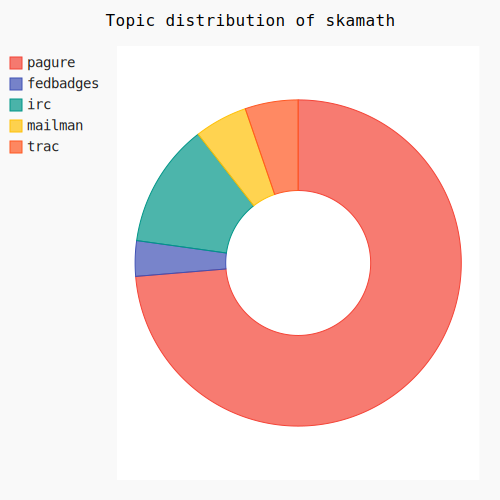
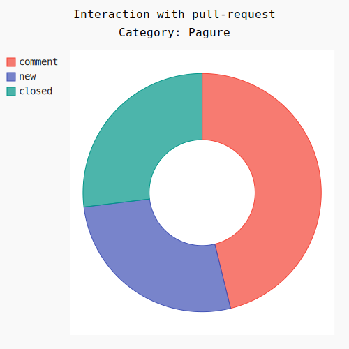

Tags: fedora,gsoc,python
Title: Digging deep into datagrepper - More Statistics Features
Date: 2016-06-06 20:06:59
Category: gsoc
Slug: digging-deep-into-datagrepper-more-statistics-features
Cover: https://summerofcode.withgoogle.com/static/archive/img/archive-header.png

This week was really exciting as I worked further on my [statistics tool](https://pagure.io/gsoc-stats) for the Fedora and Redhat summer interns. Last week, I had worked on some features like text reports and visualization.

After the basic skeleton written last week, a lot of features were added to the tool including CSV and markdown output, detailed analytics of a category and category-based text reports. Time to dive into the tool.

To gather statistics of a user, you basically run the tool either in interactive mode or with the necessary arguments. Let me generate my category-wise report as **SVG** for this week. The command to do that'd be  `python main.py --user=skamath --mode=svg`. The number of weeks defaults to 1. Let's see what I've got.

>All these SVG's are interactive. Right click and select `View Image` to get a feel of it. Hover to view percentages and filter by clicking on the color legends.

Awesome! I just got my activity donut. I have interacted a lot with Pagure this week. Hmm, let's take a closer look at that.

To generate the detailed statistics of a particular category, the `--category` needs to be set while running the tool. By default, it is set as `None`.

This time, the command will be `python main.py --user=skamath --mode=svg --category=pagure`, and BHAM!

11 interactions with issues and 26 interactions with pull-request.

Under issues, 73% was issue edits and the rest was comments on issues. Boy, fedmsg is powerful - isn't it?

Under pull requests, around 46% were comments and rest were equally distributed among new and closed PR's :)

Similarly, statistics in text mode and markdown can also be generated. Markdown can easily be converted to HTML pages and also can be used to update the blog with weekly reports.

Here is the [full text log](https://paste.fedoraproject.org/375509/) generated by the command `python main.py --user=skamath`. I am not using mode here because it defaults to `text`

Apart from the metrics features, I also added an interactive mode for the tool which can be accessed by `python main.py --interactive`. All the arguments required will then be prompted by the tool *(as the name suggests, interactively)*.

There's a lot more to be improved. I have miles and miles to go, before I sleep :)
