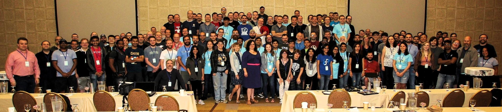

Tags: fedora, travel, conference
Title: Flock '17 - Day 1
Date: 2017-09-06
Slug: flock-17-day-1
Cover: https://i.imgur.com/yLW8oczg.jpg
Category: conferences

After a good nights sleep, I woke up pretty early for attending the session lined up on Day1. I walked to a nearby restaurant for breakfast and rushed back to the conference room just in time for the traditional State of Fedora Talk by the FPL (Fedora Project Leader), [Matthew Miller](https://fedoraproject.org/wiki/User:Mattdm). He used beautiful graphs to explain how Fedora was progressing, and also discussed the possibility of expanding the community and user base further. It was fascinating to look at the charts and see how Fedora usage has increased and decreased over the years and how various changes in the distro affected the popularity. If you are reading this, I highly recommend you check out his [slides](https://mattdm.org/fedora/2017flock/2017-State-of-Fedora.pdf).

We had a group photo session shortly after mattdm's talk, and the stage was almost full. Here's a picture of a lot of people saying 'Linux' _(because Cheese is too mainstream and already packaged for Fedora)_ :

After the opening talk, everyone hosting a session had to do a 30-second pitch on what they are presenting about and why it's going to be an excellent one.

If you're wondering how many sessions were planned for Flock, here's the [schedule](flock2017.sched.com).

My schedule was set for the day. I grabbed some coffee and went around meeting people until lunch. The first session post lunch that I attended was the Pagure Hackfest, which was posted by [pingou](https://fedoraproject.org/wiki/User:Pingou). I had also volunteered to do the AV recording for the session, so I quickly set up the recorder and settled down.

Pingou gave an introduction to Pagure and explained what each component does, as it is in the Pagure docs. The quick introduction helped me understand how Pagure actually works under the hood. I had set up my development environment before the session, so I started hacking right away! Browsing through the list of easy fixes, I found a bug that looked simple enough to start with. Since the code base was relatively huge, I started grepping through it to find the relevant part. After looking around a bit, I found the code that required fixing, patched it up and ran the tests - which obviously blew up. Pingou helped me understand what was going on and I finally did fix it finally _(Curse the email header format!)_. <strike>A PR is pending on pagure for this</strike> [My first PR](https://pagure.io/pagure/pull-request/2567) just got merged into Pagure o/

In my opinion, this was one of the best sessions I attended because I contributed to it and there was more hacking than talking. As I worked on the easy fixes, the infra folks were trying to zap the bigger bugs (which they did!). I secretly wished all sessions were hack-sessions and not the regular talks after attending the Pagure Hackfest :)

The next thing on my schedule was a talk on Fedora Hubs. Hubs is the next big thing coming up in the Fedora community, which is going to change a **lot** of things - starting from onboarding contributors to helping the members to keep track of meetings, badge progress and more. [Sayan Chowdhury](https://fedoraproject.org/wiki/User:Sayanchowdhury) & [Auruelien Bompard](https://fedoraproject.org/wiki/User:Abompard), the developers of Fedora Hubs explained how Hubs work and how it can make an make a difference in the way we work in the community now. [Mairin Duffy](https://fedoraproject.org/wiki/User:Duffy), the UX designer of Fedora Hubs showed us how Hubs is going to look like. This was an introduction to the Hubs Hackfest that was planned for Day 2, and the pitch for it during the session was perfect! I decided to get Hubs up and running later at night to attend the hack session next day.

Next up on my schedule was the Fedora Magazine Workshop. I participated in this session because I follow the magazine closely, and was always curious to know more about how they work to get the best articles published. The talk was really interesting as they talked about the life cycle of an article, right from the pitch stage - where a user could pitch an idea to the Magazine team, to the scheduling stage - where the people who had the publishing rights on the Magazine Wordpress instance could set a time to publish the polished article. The session wrapped up with a lot of people suggesting new articles for the magazine.

After all the sessions, we had a game night and international candy exchange - where people brought sweets and savouries from all around the world and shared with the rest of the community. The candy exchange was the biggest one so far, thanks to Justin who coordinated it. If you are wondering what the candy table looked like, here is an [imgur image](https://imgur.com/a/Yb2KW).

It was a great day! I did so much, learned even more and had a lot of fun. Oh, and did I mention we had unlimited pizza for the game night? ;)
