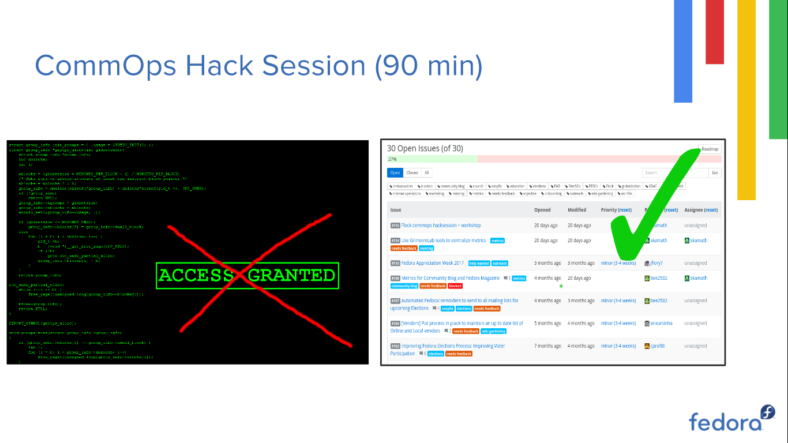

Tags: fedora, travel, conference
Title: Flock '17 - Day 2
Date: 2017-09-08	
Slug: flock-17-day-2
Cover: https://i.imgur.com/yLW8oczg.jpg
Category: conferences

I woke up pretty early for day 2 because my session was the first one for the day, and I had to polish my slides a bit. We had the usual introduction to the day by Bex which was followed by my CommOps and metrics workshop.

The workshop was split into two: 90 minutes for the metrics workshop and introduction and the rest of the time was for the CommOps Hack session. To begin with, Justin gave an introduction to CommOps for the new faces in the room and, I explained how CommOps used metrics to understand the community better.

I started the metrics session with a quick tutorial on how to use datagrepper. It was only 5 minutes since I started and datagrepper started throwing status code `500`. Great! Datagrepper was down and almost all my tutorial assumed that datagrepper will be running happily :( Thankfully, I had screenshots and backup data which I had generated for past GSoC interns. I quickly cloned the repo and continued my demo with that. After the datagrepper demo, I talked about the future of metrics and the idea to centralize all the metrics generation using the [GrimoireLabs tool suite](grimoirelab.github.io). I fired up a test instance of the Kibana dashboard to demonstrate this and explained what can be done with it. The dashboard was configured to pull data from datagrepper so I couldn't show a real-time dashboard :(

After the metrics session, we initialized our traditional CommOps Hack session. For anyone who wants to know what we do, here is an image from my slides :

<small>Fig 1 : CommOps Hack Session = Work on the open tickets in Pagure</small>

During the session, we discussed the idea of FOSS Student pack, Fedora Appreciation Week, future of metrics and wiki gardening. After about 30 min, Bex hijacked the session (for good) and talked about how technical onboarding can be made better. After the discussion, we decided to start experimenting with the Python folks of Fedora and try and get more Fedora Hubs contributors o/

We broke for lunch at 12, and I returned at around 2 for the Fedora Hubs hack fest. During the hack fest, the Fedora Hub devs _(yeah, the ones mentioned in the last post)_ helped everyone set up the dev environment and gave a quick tutorial on how to build widgets for Hubs. Hubs is all set to hit production and it was really exciting to be part of the development :)

After the Hubs workshop, I explored the place a bit, did a bit of shopping and had truckloads of fun at Wackenhammer's Clockwork Arcade and Carousel, where we had unlimited arcade coins. I picked up some stuffed dolls from the crane machine and gave it away to the kids _(because I didn't fancy having pink unicorn stuffed toys :3)_, and also wrecked a wrote of people in multi player arcade games _(sorry, had to mention it)_. We also got a really cool badge for this party \o/

TL;DR : It was an **awesome** day, a perfect blend of hacking and partying.
