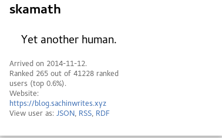

Tags: fedora,gsoc,python
Title: The final week - GSoC Wrap Up
Date: 2016-08-15 09:05:46
Slug: gsoc-final-week
Cover: https://communityblog.fedoraproject.org/wp-content/uploads/2016/03/gsoc-announce-1.png
Category: gsoc

Happy Independence day, India!

Also, today marks the beginning of the GSoC deadline week. This post will wrap-up what I have done during my intern period.

#Community Bonding period

  * Figure out how fedmsg works

        fedmsg (FEDerated MeSsaGe bus) is a python package and API defining a brokerless messaging architecture to send and receive messages to and from applications.

fedmsg was used to gather messages for statistics generation.

   [Documentation](http://www.fedmsg.com/en/latest/)

* Figure out how datagrepper works.

        Datagrepper is a web-app to retrieve historical information about messages on the fedmsg bus. It is a JSON API for the datanommer message store.

Datagrepper queries were made to retrieve messages for users and was letter compiled into one bigger JSON file and rendered into other forms of output.

[Reference](https://apps.fedoraproject.org/datagrepper/reference)

* Familiarize with all the tools in Toolbox.

        CommOps Toolbox is a set of tools that aims at automating tedious tasks.

I had to deliver a tool which could be combined with the existing tools for CommOps storytelling and Metrics process.

[Reference](https://fedoraproject.org/wiki/CommOps#Toolbox)

#Coding Period - Mid Term

 
**1st Quarter:**

* Onboarding Series - Badge Identification

     * Onboarding is really important for large communities like Fedora. Until Fedora Hubs arrives, badges were decided to be an ideal way to track progress.

     * Started digging information on badges and how it works.

*  Automated GSoC Reports
    * A tool was to be delivered that could initially give statistics of all the Fedora / RedHat / Outreachy interns that would automatically generate CSV's and graphs based on a user's activity. Scaling the tool was pushed for later.

    * Repo for data : https://github.com/sachinkamath/fedstats-data/

*  Badges .yaml definitions
    * This was pushed for as the tool had to added into the toolbox before the mid-term.

*  Automate Events Report Analysis

   *  Bee's Script (to be uploaded) as a start

   *  Parse a csv, give rudimentary stats about users/fedmsgs:
           Using stats-tool : [PyCon Data](https://docs.google.com/spreadsheets/d/11vOxzGmZKagfHYlkW4dXY4EovRcUXVxOJ5OsEId0DBE/edit#gid=0) ( PyCon US Statistics was generated using this tool)

**2nd Quarter:**

* Work on adding more features to the tool
    * More output options such as markdown, gource and csv was added during this period
 

* Generate mid-term reports

    * Public repo : [fedstats-data](https://github.com/sachinkamath/fedstats-data/tree/master/interns-mid-term)

**Blog Posts for this period**

[Summer with Fedora](https://sachinwrites.xyz/2016/05/02/gsoc-16-summer-with-fedora/)

[Let the Coding Begin](https://sachinwrites.xyz/2016/05/25/gsoc-16-let-the-coding-begin/)

[Getting fedstats production ready](https://sachinwrites.xyz/2016/05/28/getting-fedstats-gsoc-production-ready/)

[Digging deep into datagrepper](https://sachinwrites.xyz/2016/06/06/digging-deep-into-datagrepper-more-statistics-features/)

[Mid term Overview](https://sachinwrites.xyz/2016/06/21/fedstats-a-final-overview/)

#Mid-term to Finals

   * Scale GSoC metrics script for teams and events.
       * https://sachinwrites.xyz/tag/gsoc
       * https://pagure.io/gsoc-stats/branch/develop

   * Improving the efficiency of the script.
       * Local JSON caching and organized output pulls.

   * Scraping an entire group

    * Using the python-fedora API, it was made possible. Selenium and bs4 didn't work due to CSRF issues.

   * Onboarding - One at a time, extends Post- GSoC

 * https://fedorahosted.org/fedora-badges/ticket/464
  * https://fedorahosted.org/fedora-badges/ticket/466
 * https://fedorahosted.org/fedora-badges/ticket/434
 * https://fedorahosted.org/fedora-badges/ticket/441
 * https://fedorahosted.org/fedora-badges/ticket/442

   * Contributor Statistics using GSoC tool

* More details in [this](https://sachinwrites.xyz/2016/08/06/identifying-fedora-contributors-stats-for-flock/) blog post.

* Statistics was presented at Flock by bee. [Presentation Link](https://docs.google.com/presentation/d/1ANub0RZtqnLaBDzpiQRUkZdnf7n75Pn9H16gb0wZg68/)

   * Code Scrubbing and style fixes

**Blog Posts for this period**

[Journey So Far](https://sachinwrites.xyz/2016/06/29/gsoc-journey-so-far-badges-milestones-and-more/)

[Understanding statscache](https://sachinwrites.xyz/2016/07/17/understanding-the-statscache-daemon/)

[Improving statistics using python-fedora API](https://sachinwrites.xyz/2016/07/24/improving-statistics-using-python-fedora-api/)

[Final touches and road ahead](https://sachinwrites.xyz/2016/07/30/fedstats-final-touches-and-road-ahead/)

[Identifying Fedora Contributors](https://sachinwrites.xyz/2016/08/06/identifying-fedora-contributors-stats-for-flock/)

#Post GSOC

* Work on statscache
    * https://github.com/fedora-infra/statscache
* Modularize existing tool - Work in Progress
    * https://pagure.io/gsoc-stats/branch/modular
* Master tool for all in one metrics
    * Integrate badge statistics, a flask front-end for metrics for one-click statistics generation.

Working with the amazing people over at Fedora was indeed a really good experience. In this 3 months, I collected around [51 badges](https://badges.fedoraproject.org/user/skamath).

One badge which I am really proud of this the black and white cookie badge, given to users who have helped 25 Fedorans. It has been only awarded to 31 times so far. Cookies! \o/

Current badges rank, Gotta Badge 'Em All!

Current Repository statistics :

